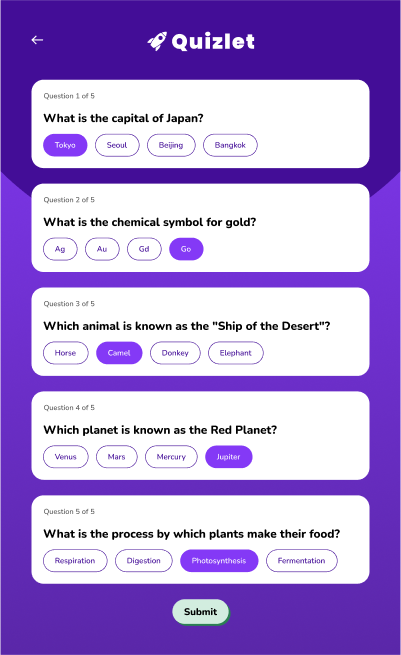
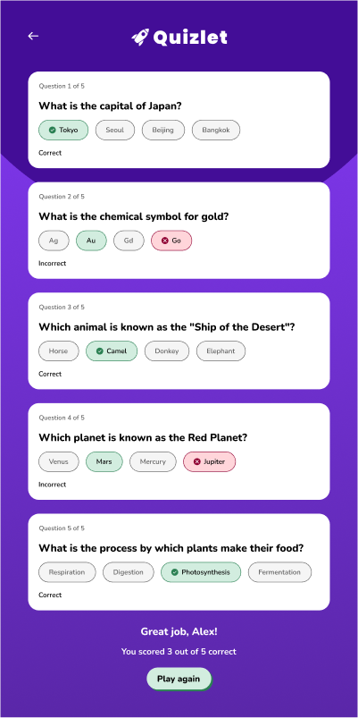

# 🧠 Quiz App

A simple yet engaging quiz application built with **React**. The app fetches quiz questions from the [Open Trivia DB API](https://opentdb.com/), displays multiple-choice questions, and evaluates user responses with a clean and responsive UI.



*Quiz screen: Users select answers for each question*



*Results screen: Displays score and a phrase based on the users score*

## 🎯 Overview

This project helped me understand:

* React's component-based structure
* API integration with **fetch**
* State management using React Hooks
* Conditional rendering for UI updates
* Managing user input and scoring logic
* Modular code organization for scalability

---

## 🛠 Tech Stack

* **React** – Component-based frontend framework
* **JavaScript (ES6+)** – Core logic and interactivity
* **HTML5 / CSS3** – Responsive layout and styling
* **React Confetti** – Fun celebration effects for correct answers
* **Open Trivia DB API** – Source of quiz questions

---

## ✨ Key Features

* Fetches quiz questions dynamically from an external API
* Multiple-choice question cards with instant feedback
* Score calculation and randomized encouragement phrases
* "Play Again" functionality for a fresh quiz each time
* Confetti celebration effect on quiz completion
* Modular, reusable React components

---

## ⚙️ Build Process

1. **Clone the repository:**

   ```bash
   git clone https://github.com/your-username/quiz-app.git
   cd quiz-app
   ```

2. **Install dependencies:**

   ```bash
   npm install
   ```

3. **Start the development server:**

   ```bash
   npm start
   ```

4. **Build for production:**

   ```bash
   npm run build
   ```

---

## 🧪 Testing

This project includes a simple test using **React Testing Library**:

```bash
npm test
```

---

## 📚 Lessons Learned

* **React Hooks:** Managing state with `useState` and lifecycle with `useEffect`
* **API Integration:** Fetching and transforming external data for UI
* **Component Design:** Breaking the UI into small, reusable components
* **Conditional Rendering:** Dynamic button states, correct/wrong answers, and results
* **Randomization:** Generating random encouragement phrases for variety

---

## 🧩 Areas for Improvement

* Add mobile-responsive design
* Implement user authentication for score tracking
* Include loading and error states
* Add difficulty levels and quiz categories
* Expand unit tests for all components
* Improve accessibility with ARIA roles

---

## 🚀 Future Enhancements

* **Leaderboard** for tracking top scores
* **Offline mode** with local storage caching
* **Theme customization** (dark/light mode)