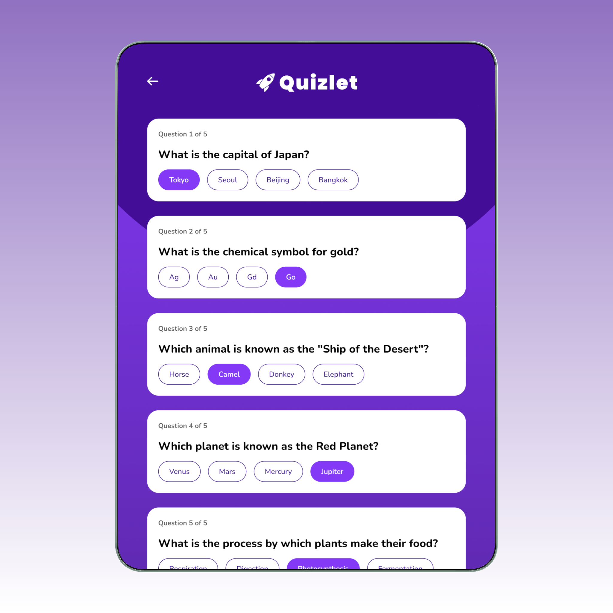
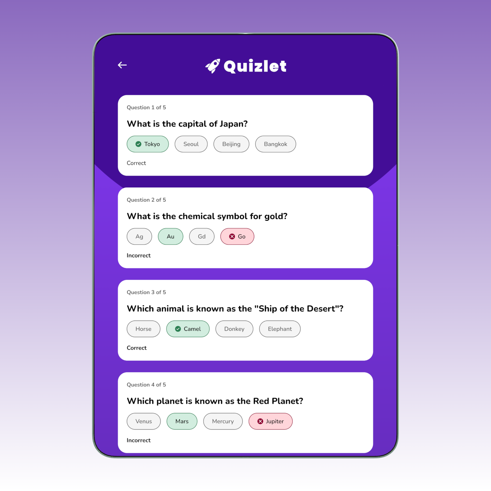
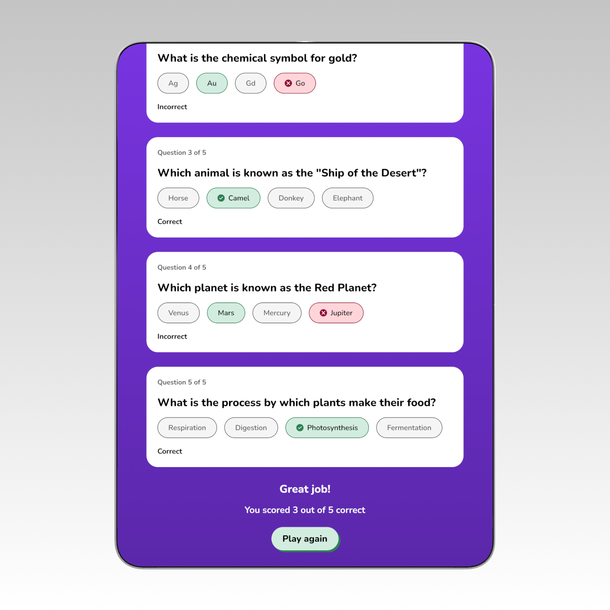

# 🧠 Quiz App

A simple yet engaging quiz application built with React and **client-side routing**. It fetches multiple-choice questions from the Open Trivia DB API, lets users **choose a category and difficulty**, presents questions in a clean interface, and evaluates responses. On completion, users get a tailored message based on their score.


*Setup screen: Select category & difficulty, then start your quiz*





*Results screen: Displays score and a phrase based on the user’s score*

---

## 🎯 Overview

This project helped me understand:

* React’s component-based structure
* **Routing with React Router** (Home → Quiz)&#x20;
* API integration with `fetch`
* State management using React Hooks
* Conditional rendering for UI updates
* Managing user input and scoring logic
* Modular code organization for scalability

---

## 🛠 Tech Stack

* **React** – Component-based UI
* **React Router** – Client-side routing between pages&#x20;
* **JavaScript (ES6+)**
* **HTML5 / CSS3**
* **React Confetti** – Celebration effects
* **Open Trivia DB API** – Source of questions

---

## ✨ Key Features

* **Client-side routing:** `/` (Home) and `/quiz` (Quiz) via React Router&#x20;
* **Configurable quiz:** Users choose **difficulty** and **category** on Home; values are read via `FormData` and sent to the Quiz page using **router state**&#x20;
- **Lazy loading with `React.Suspense`:** `QuestionCard` is loaded on demand to keep initial loads snappy
- **Accessible results announcement:** A **screen reader live region** politely announces the score without stealing focus:
  ```jsx
  {/* Screen reader live region: announces result without moving focus */}
  <p className="sr-only" aria-live="polite" aria-atomic="true">
    {submitted ? `You scored ${scoreResults} out of ${numberOfQuestions}.` : ""}
  </p>
* **Dynamic API URL:** Quiz page builds the OpenTDB URL from those user selections using `URLSearchParams`.&#x20;
* Multiple-choice question cards with instant feedback
* Score calculation and encouragement phrases based on score
* “Play Again” fetches a fresh set of questions
* Confetti celebration on completion

---

## 🧭 How It Works

* **Home → Quiz navigation:** The Home page form gathers `difficulty` and `category`, then navigates to `/quiz` with `{ filters }` in router state.&#x20;
* **Building the request:** The Quiz page reads those filters and constructs the API URL like:

  ```
  https://opentdb.com/api.php?amount=5&type=multiple&difficulty=easy&category=9
  ```

  (keys included only when selected).&#x20;

---

## ⚙️ Build & Run

1. **Clone the repository**

   ```bash
   git clone https://github.com/your-username/quiz-app.git
   cd quiz-app
   ```

2. **Install dependencies**

   ```bash
   npm install
   ```

3. **Start the dev server**

   ```bash
   npm start
   ```

4. **Build for production**

   ```bash
   npm run build
   ```

---

## 🧪 Testing

Run tests with:

```bash
npm test
```

*(The starter test file is included; expand with component tests as you iterate.)*&#x20;

---

## 📚 Lessons Learned

* **React Hooks:** Managing state with `useState` and lifecycle with `useEffect`
* **API Integration:** Fetching and transforming external data for UI
* **Routing:** Splitting flows into pages and passing state via navigation&#x20;
* **Component Design:** Breaking the UI into small, reusable components
* **Conditional Rendering:** Dynamic button states, correct/wrong answers, and results
* **Accessibility & UX:** Focus management, live announcements, and smooth scrolling


---

## 🧩 Areas for Improvement

* Add more mobile-responsive refinements
* Implement error states
* Expand unit tests for all components
* Improve accessibility (labels, focus styles, ARIA roles)
* Persist scores to local storage or backend


---

## 🚀 Future Enhancements

* **Leaderboard** for top scores
* **Offline mode** with local storage caching
* **Theme customization** (dark/light mode)
* **Render QuizPage after data is loaded**: instead of showing the page before questions arrive, display a lightweight loader or fetch first, then render the quiz. This avoids any perceived delay or empty state while questions load, reducing user frustration.&#x20;

---

## 🧭 Project Structure (excerpt)

* `src/pages/Home.jsx` – Form for category/difficulty; navigates with router state.&#x20;
* `src/pages/QuizPage.jsx` – Builds API URL from filters; renders questions & results.&#x20;
* `src/App.js` – App routes (`/`, `/quiz`).&#x20;
